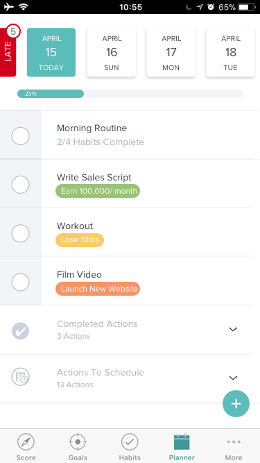

# Planner Checkbox

In this project we're updating the checkboxes to look like the design
in the mockup.

All you have to worry about is styling the checkbox items, the other
elements on the page are either things you've worked on already or
will be working on in the future.

One difference is you'll see in the app we have edit and delete buttons
that aren't in the designs.

We're keeping these, so try your best to make them fit with the rest of
the design.
